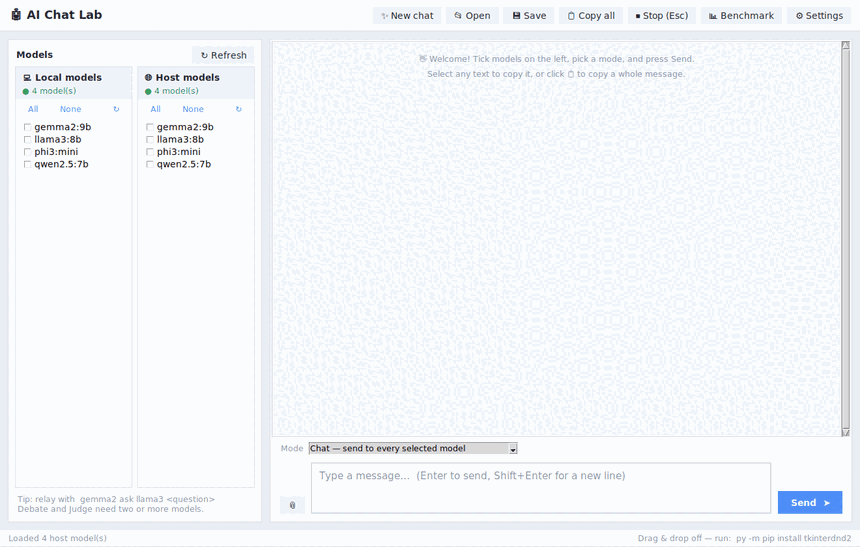
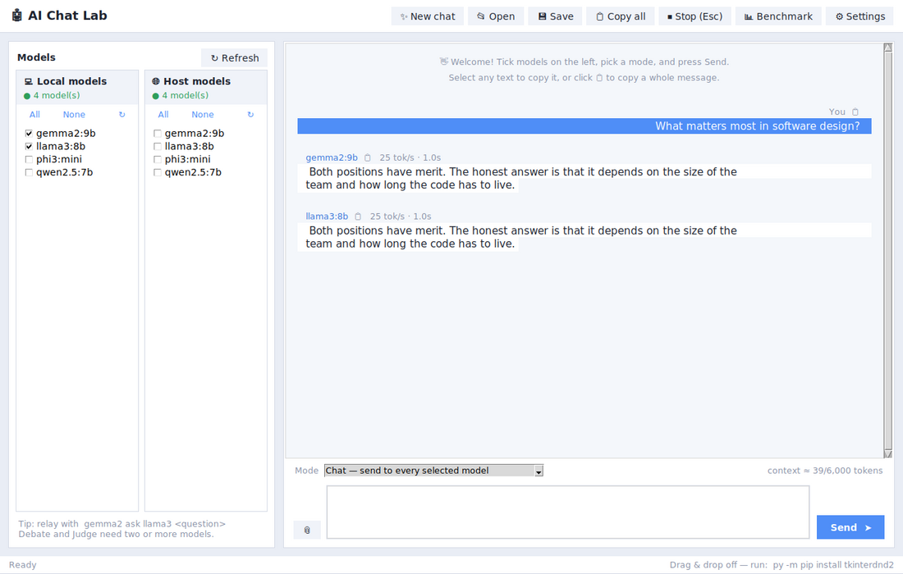
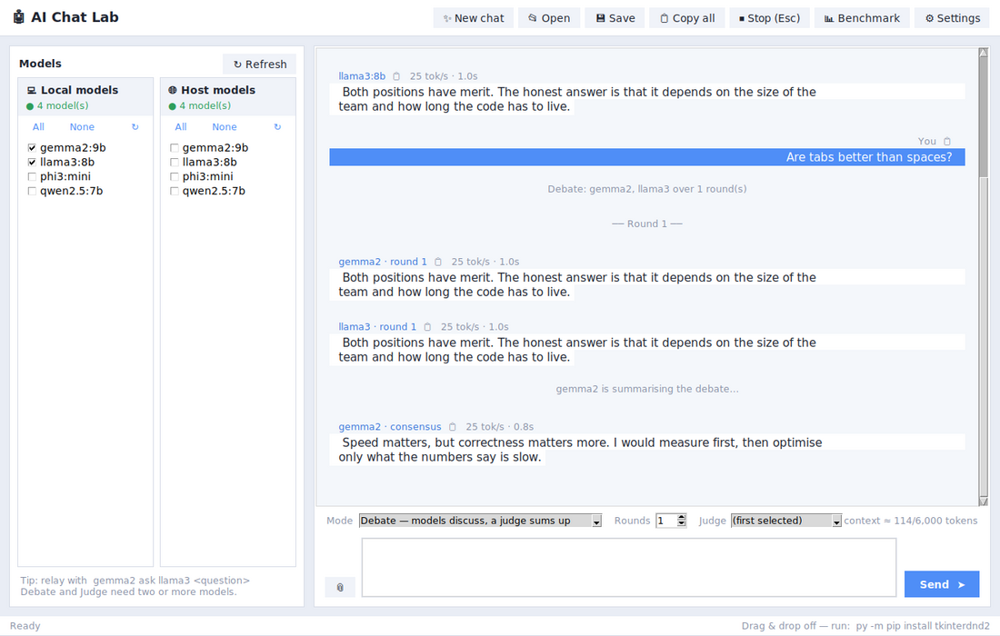
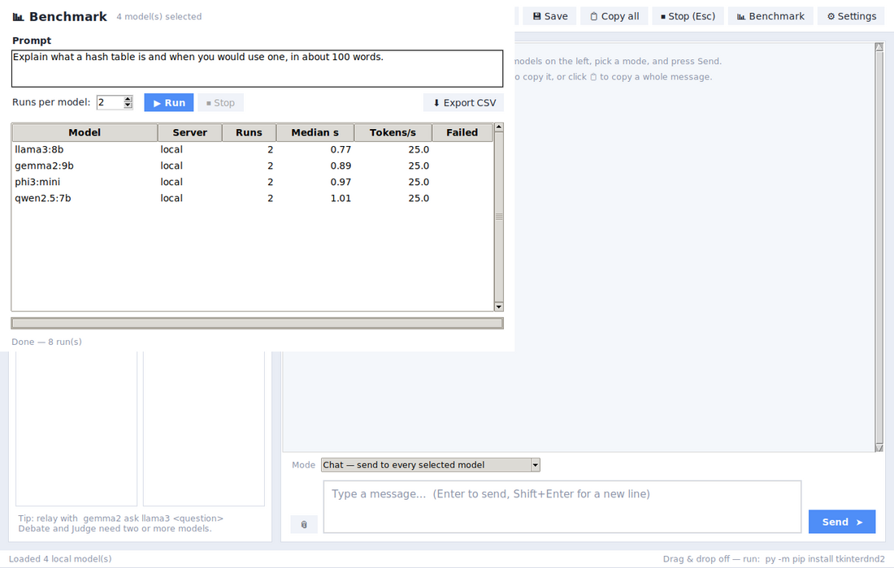
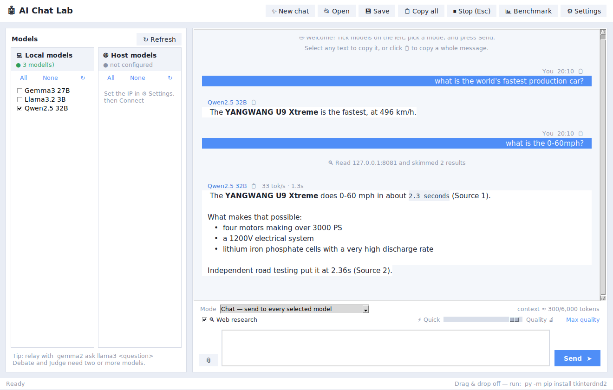
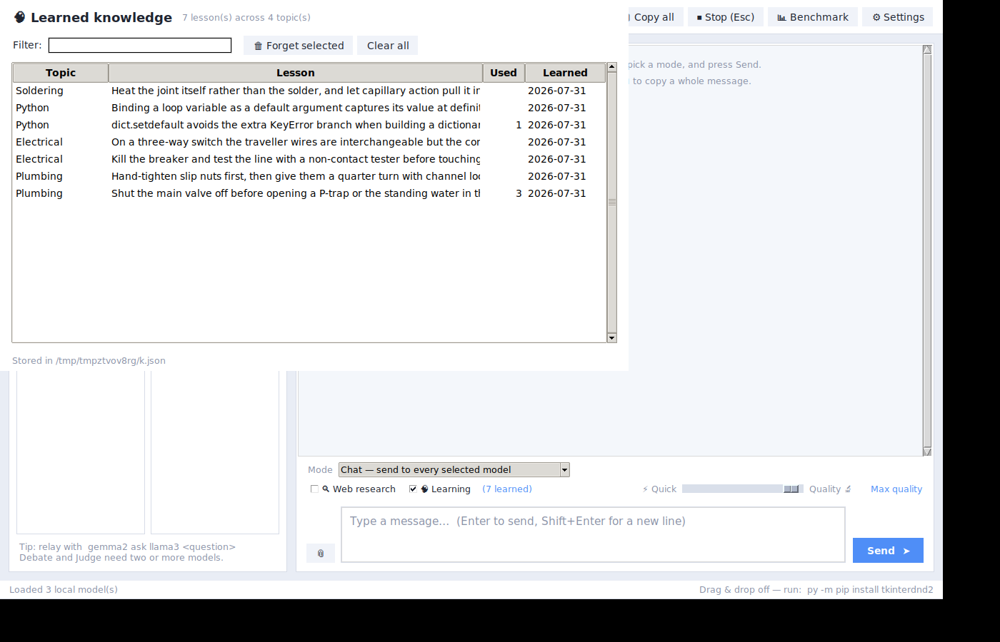

# AI Chat Lab

A desktop harness for running **many local LLMs at once** and making them work
together — broadcast a prompt to every model, have two models interview each
other, run a structured debate with a judge, or benchmark a dozen models on the
same question and see which one is actually worth using.

Built on [Ollama](https://ollama.com), it pools models from **your own machine
and a networked box** into one interface.



---

## Why this exists

Most Ollama front-ends are a chat window for one model at a time. The
interesting question with a folder full of local models is not "what does
llama3 say?" but "what do five models say, where do they disagree, and which
one is fastest?" This app is built around that question.

## Features

**Orchestration modes.** Four ways to put models to work, each a pattern in
common use:

| Mode | What happens | Known as |
| --- | --- | --- |
| Chat | One prompt fans out to every selected model in parallel | broadcast |
| Debate | N models argue over R rounds, each seeing the transcript, then a judge synthesises | mixture-of-agents |
| Critique chain | One model drafts, a second critiques, a third rewrites | critique loop |
| Judge panel | Models answer blind, a separate model scores them anonymously | LLM-as-judge |

Plus ad-hoc relays typed straight into the chat: `gemma2 ask llama3 what do you
think about this design?`

**Streaming with real cancellation.** Replies render token by token. Stop
closes the HTTP connection, so the server actually stops generating rather than
finishing the work and having the answer discarded.

**Two model pools.** Local and networked Ollama servers side by side, each with
its own connection status, discovered at runtime.

**Benchmarking.** Run one prompt across every selected model, repeated N times,
and get median latency and tokens/sec in a sortable table with CSV export.

**Web research via SearXNG.** Point the app at a self-hosted
[SearXNG](https://docs.searxng.org) instance (the Docker metasearch engine)
and flip on the 🔍 toggle: your question is searched, the top pages are
fetched and reduced to readable text, and the models answer from numbered
sources they can cite — entirely on your own infrastructure.

**Speed ↔ quality slider.** One slider trades response length for time, from
"a few sentences, fast" to "uncapped and thorough". Under the hood it maps to
Ollama's `num_predict` token cap plus a style directive in the system prompt.

**Reads like a conversation.** Replies render markdown as real formatting
instead of literal asterisks, models are shown by name rather than by filename
("Qwen2.5 32B", not `qwen2.5:32b-instruct-q4_K_M`), consecutive replies from one
model group under a single header, and a typing indicator shows while a model
thinks. A conversational system prompt stops models restating your question
back at you.

**Learning mode.** Turn on 🧠 Learning and each exchange is mined for durable,
reusable knowledge — how to bleed a radiator, why `dict.setdefault` beats a
`KeyError` branch — which is stored on disk and recalled in later, unrelated
chats. Anything time-bound (weather, prices, news) is refused outright, near
duplicates are dropped, and everything it holds is listed in a window you can
filter and prune, because a knowledge base you can't inspect is a black box
shaping every answer.

**Research caching.** Asking the same thing twice reuses the earlier research
instead of searching and re-fetching pages. Staleness depends on the question:
"how do I sweat a copper pipe" keeps for hours, "what's the weather this
weekend" for fifteen minutes. Near-identical wording counts as a hit. The cache
lives in a temp file and anything a throwaway chat added is deleted on exit.

**Follow-ups that remember the thread.** Ask "what's its 0-60?" after talking
about a car and the search goes out for *that car* — a small model call rewrites
the question into a standalone query, with a proper-noun heuristic as fallback.

**Document attachments.** PDF, Word, PowerPoint, Excel and plain text are
parsed to real text — attach by button or drag and drop.

**Context budgeting.** Token usage is estimated live and old turns are trimmed
to a configurable budget, so long sessions and big documents stop silently
overflowing model context.

---

## Screenshots

| Parallel streaming | Structured debate |
| --- | --- |
|  |  |

| Benchmark | Web research with a follow-up |
| --- | --- |
|  |  |

| What the models have learned |
| --- |
|  |

---

## Install

Requires Python 3.9+ and [Ollama](https://ollama.com) running somewhere.

```bash
git clone https://github.com/<you>/ai-chat-lab
cd ai-chat-lab
pip install -r requirements.txt
python run.py
```

On Windows you can also just double-click **`AI Chat Lab.pyw`**.

Only `requests` is required. The rest are optional and each unlocks one
feature: `pypdf` (PDF attachments), `openpyxl` (Excel attachments),
`tkinterdnd2` (drag and drop).

### Enabling web research

Web research talks to your own SearXNG instance — no API keys, no third-party
service. SearXNG only answers JSON requests when the format is enabled, so add
this to your `searxng/settings.yml` and restart the container:

```yaml
search:
  formats:
    - html
    - json
```

Then enter the instance URL under ⚙ Settings → Web research, press Connect,
and tick 🔍 Web research above the message box. (If you forget the settings.yml
step, the Connect test tells you exactly what to add.)

### Try it without a GPU

A mock server streams fake replies so you can explore every mode:

```bash
python tools/mock_ollama.py 11434 11435
python run.py          # both model columns will populate
```

---

## Architecture

The Tkinter front-end is a thin shell over a UI-free core, which is what makes
the orchestration patterns testable without a display or a network.

```
aichatlab/
  client.py        streaming Ollama client, cancellation, timing capture
  orchestrator.py  broadcast / relay / debate / critique / judge  ← no UI imports
  session.py       conversation state, context budgeting, save & load
  documents.py     PDF, DOCX, PPTX, XLSX and text extraction
  formatting.py    markdown rendering, readable model names
  research.py      SearXNG search, page reading, follow-up query rewriting
  cache.py         research reuse, per-question staleness, session cleanup
  knowledge.py     lesson extraction, storage and keyword recall
  benchmark.py     timed runs, aggregation, CSV export
  config.py        settings persistence
  ui/
    app.py             main window, event pump
    chatview.py        streaming transcript widget
    benchmark_window.py
    dialogs.py         settings
    knowledge_window.py
tests/             188 tests, no network and no display required
```

Work runs on background threads and communicates with the UI through a queue
that the main loop drains on a timer — Tk widgets are only ever touched from
the main thread.

## Tests

```bash
pip install pytest
pytest
```

188 tests covering stream parsing, mid-stream cancellation, error propagation,
every orchestration pattern, context trimming, document extraction, benchmark
aggregation, markdown rendering, follow-up resolution, cache expiry, lesson
extraction and transcript rendering. HTTP is mocked; the handful of widget
tests skip themselves when no display is available.

---

## Four bugs worth reading the code for

**Binary attachments poisoning the context.** Attaching a PDF used to decode
the raw bytes as text, pushing ~200,000 characters of compressed binary into
the prompt. The visible symptom was a *500 from the inference server* — a
failure that surfaced nowhere near its cause. Now every format has a real
extractor and genuinely binary files are refused. (`documents.py`, and the
regression test in `tests/test_documents.py`.)

**Interleaved streams.** With several models streaming at once, every reply
landed in the same bubble, word by word. Each message anchors to a Tk text
mark, but the marks were being set before the bubble padding was inserted, so
right-gravity slid them all to the end of the widget. Fixed by capturing the
index first and setting the mark afterwards. (`ui/chatview.py`, regression test
in `tests/test_chatview.py`.)

**Selection that wasn't invisible, it was painted over.** AI replies looked
unselectable — dragging did nothing visible, so Ctrl+C seemed broken. Selection
was working the whole time: Tk gives tags created after the widget a higher
priority than the built-in `sel` tag, so each bubble's opaque background drew
straight over the highlight. One `tag_raise("sel")` fixed it. The regression
test asserts on tag *ordering* rather than on pixels, which is the invariant
that actually broke.

**Objects quietly rebuilt on every keystroke.** The research cache and
knowledge base were being constructed inside `_hide_placeholder`, which runs
whenever the user starts typing. Everything still *worked* — searches were
cached, lessons were saved — but each new object lost track of what the current
session had added, so nothing was ever cleaned up on exit. Nothing crashed and
no test failed; it only surfaced because an end-to-end check asserted the cache
file was gone after closing an unsaved chat. (`tests/test_app.py`.)

## Licence

MIT
