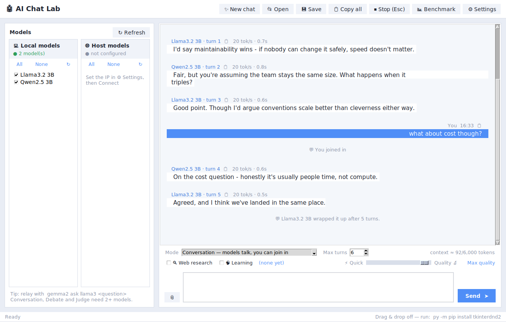
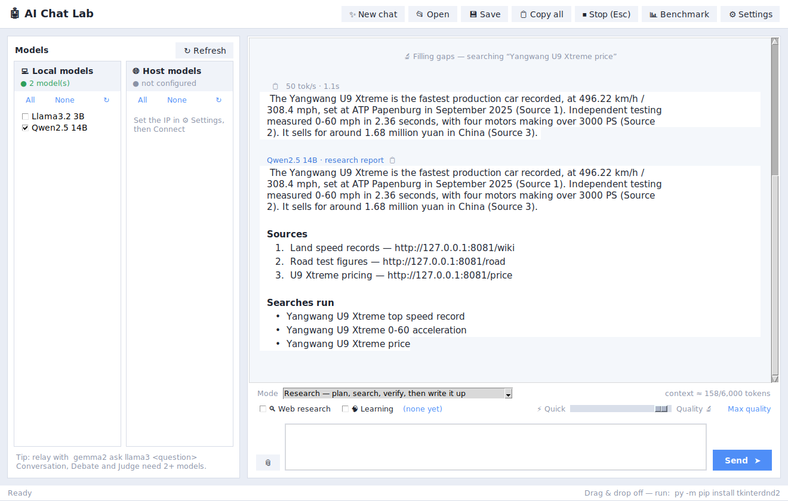

# Ensemble AI Studio

*Local Multi-Model Orchestration and Agent Workspace.*  (Formerly AI Chat Lab.)

A desktop harness for running **many local LLMs at once** and making them work
together — broadcast a prompt to every model, have two models interview each
other, run a structured debate with a judge, or benchmark a dozen models on the
same question and see which one is actually worth using.

Built on [Ollama](https://ollama.com), it pools models from **your own machine
and a networked box** into one interface.

> **Hosted edition:** the same orchestration engine runs on **Google Cloud Run**
> with **Gemini on Vertex AI** standing in for the local GPUs — see
> [Running on Google Cloud](#running-on-google-cloud). The live demo link is in
> the repository description.


---

## Why this exists

Most Ollama front-ends are a chat window for one model at a time. The
interesting question with a folder full of local models is not "what does
llama3 say?" but "what do five models say, where do they disagree, and which
one is fastest?" This app is built around that question.

## Features

**Orchestration modes.** Seven ways to put models to work, each a pattern in
common use:

| Mode | What happens | Known as |
| --- | --- | --- |
| Chat | One prompt fans out to every selected model in parallel | broadcast |
| Plan & work | The model writes a checklist, works each step, then pulls it together | plan-and-execute |
| Research | Plan several searches, read widely, draft, fact-check, fill gaps, write up | iterative RAG |
| Conversation | Models talk to each other until they wrap up; you can join in mid-flow | open-ended multi-agent |
| Debate | N models argue over R rounds, each seeing the transcript, then a judge synthesises | mixture-of-agents |
| Critique chain | One model drafts, a second critiques, a third rewrites | critique loop |
| Judge panel | Models answer blind, a separate model scores them anonymously | LLM-as-judge |

Plus ad-hoc relays typed straight into the chat: `gemma2 ask llama3 what do you
think about this design?`

**Research mode.** Single-shot retrieval — one query, one search, one answer —
misses facets and never checks its own citations. Research mode runs the full
loop instead: it decomposes your question into several distinct searches, pools
and deduplicates results so one chatty domain can't dominate, reads the top
pages, drafts a cited answer, then **fact-checks itself**. A deterministic pass
catches citations pointing at sources that were never retrieved — the failure
that reads as verified but is pure invention — while a sceptical model pass
finds unsupported claims and gaps, which trigger targeted follow-up searches and
a revision. The output is a written-up answer with a numbered source list, the
searches that produced it, and an explicit "could not confirm" section.

**Conversation mode.** Pick two or more models, give them a subject, and they
talk to each other in turn — each seeing what was just said, keeping it short,
disagreeing where they disagree. Type at any point and your message is handed
to whoever speaks next, so you can steer without interrupting. They decide
when they're done, or you cap the turns, or you hit Stop.

**Streaming with real cancellation.** Replies render token by token. Stop
closes the HTTP connection, so the server actually stops generating rather than
finishing the work and having the answer discarded.

**Two model pools.** Local and networked Ollama servers side by side, each with
its own connection status, discovered at runtime.

**Benchmarking.** Run one prompt across every selected model, repeated N times,
and get median latency and tokens/sec in a sortable table with CSV export.

**Web research via SearXNG.** Point the app at a self-hosted
[SearXNG](https://docs.searxng.org) instance (the Docker metasearch engine)
and flip on the 🔍 toggle: your question is searched, the top pages are
fetched and reduced to readable text, and the models answer from numbered
sources they can cite — entirely on your own infrastructure.

**Speed ↔ quality slider.** One slider trades response length for time, from
"a few sentences, fast" to "uncapped and thorough". Under the hood it maps to
Ollama's `num_predict` token cap plus a style directive in the system prompt.

**Reads like a conversation.** Replies render markdown as real formatting
instead of literal asterisks, models are shown by name rather than by filename
("Qwen2.5 32B", not `qwen2.5:32b-instruct-q4_K_M`), consecutive replies from one
model group under a single header, and a typing indicator shows while a model
thinks. A conversational system prompt stops models restating your question
back at you.

**Learning mode.** Turn on 🧠 Learning and each exchange is mined for durable,
reusable knowledge — how to bleed a radiator, why `dict.setdefault` beats a
`KeyError` branch — which is stored on disk and recalled in later, unrelated
chats. Anything time-bound (weather, prices, news) is refused outright, near
duplicates are dropped, and everything it holds is listed in a window you can
filter and prune, because a knowledge base you can't inspect is a black box
shaping every answer.

**Research caching.** Asking the same thing twice reuses the earlier research
instead of searching and re-fetching pages. Staleness depends on the question:
"how do I sweat a copper pipe" keeps for hours, "what's the weather this
weekend" for fifteen minutes. Near-identical wording counts as a hit. The cache
lives in a temp file and anything a throwaway chat added is deleted on exit.

**Follow-ups that remember the thread.** Ask "what's its 0-60?" after talking
about a car and the search goes out for *that car* — a small model call rewrites
the question into a standalone query, with a proper-noun heuristic as fallback.

**Document attachments.** PDF, Word, PowerPoint, Excel and plain text are
parsed to real text — attach by button or drag and drop.

**Attachments outlive the conversation around them.** A folder arrives as an
ordinary user message, which means plain oldest-first trimming throws it away
first — and it is the oldest message in exactly the conversations that are
entirely about it. Attached files and folders are now kept ahead of ordinary
turns and shortened rather than dropped when even they will not fit, so
reopening a saved chat and asking one more question no longer quietly loses
the document the whole thread is about.

**Whole-folder attachments, priced before you pay.** Point it at a project
directory and it walks the tree without opening a single file, then shows you
what it found and what sending it would cost: file count, size, types, and a
live token estimate. Take everything, or turn it down by type, depth, file
count, per-file size or a token ceiling and watch the number move. Build
output and version-control internals — `.git`, `node_modules`, `__pycache__`,
`venv` — are skipped by default and named in the dialog rather than silently
dropped. The models are told which files they were given and how many they
were not, so "I can't see that file" is an available answer.

**Context budgeting, with compaction instead of amnesia.** Token usage is
estimated live and the counter turns amber then red as it fills, saying what
will be lost rather than just showing a number. When the conversation nears
the ceiling the oldest stretch is handed to a model and comes back as a
digest — decisions, facts, open threads, a few hundred tokens instead of
several thousand — which takes its place in the history while recent turns
stay word for word. Compacting twice folds the previous digest into the new
one rather than stacking summaries of summaries. There is a 🗜 Compact button
for doing it on demand. The budget is also tied to the `num_ctx` actually
requested from Ollama, so the two can't drift apart and quietly re-trim each
other's work.

**Nothing is lost by closing the window.** The conversation is written out as
it goes — after every turn, and every ten seconds during a long one — so
closing the app, or losing it to a crash or a power cut, costs nothing. The
next launch simply puts the work back where it was and says when it came from.
There is deliberately no "are you sure?" on the way out and no question on the
way in: an exit prompt is a tax paid on every close to protect the rare one,
and being greeted by a dialog about a file you have never heard of is a worse
start than finding your work where you left it. The file is thrown away the
moment the chat is saved properly, because a second copy in the temp directory
is clutter rather than insurance.

**A checklist that ticks itself off.** Every run shows the steps it is
actually going to take — read your folder, decide whether the web is needed,
ask each model, save anything worth remembering — and marks each one as it
finishes, with how long it took. Every tick is earned: work that was skipped
says skipped, work that failed says failed, and a run stopped halfway marks
the rest "not reached" rather than leaving them looking pending.

**Plan & work mode.** "Take a look at my app, make improvements, and give me a
complete list of what you changed" is not one question. Sent as one it becomes
a single enormous generation that either rambles or stops halfway, and you
cannot tell which until it ends. In Plan & work the model writes a short
checklist first, that checklist appears in the transcript, and each step runs
as its own call and ticks off as it completes — then a final pass pulls the
work together into the answer that was actually asked for. More round trips,
which on a 32B model is not free, so it is a mode you choose.

**It warns before a long silence, not during it.** Nothing comes back while a
model reads its prompt, so 23,845 tokens through a large model looks exactly
like a hang. The app now says so before sending, and once it has watched this
machine read one prompt it stops guessing and quotes a measured estimate.

**It tells you what it is doing.** A live status line names the model and the
step — thinking, writing, summarising, reading your files, searching — with
elapsed time, tokens so far and tokens per second, updated every half second.
If nothing arrives for thirty seconds it says so once, distinguishing "still
working" from "a large model is probably still loading". Stop is honest too:
cancellation is checked between the chunks a server streams back, so a server
that has gone quiet cannot be interrupted until it speaks, and the app now
admits that rather than looking broken.

**A run log.** Every request this session made — model, purpose, duration,
prompt and reply tokens, tokens per second, and how it ended — in a sortable
window with CSV export. It also reads the table for you: six replies cut off
at the same cap is a slider problem, and it says so.

**Typing while it works.** A message sent mid-run used to be thrown away with
"Still working — press Stop first", which made you the scheduler. It is now
held, and you are asked the only question that matters: does this replace what
is running, or follow it? Interruptions like "stop, wrong file" lead with
stopping; ordinary follow-ups lead with queueing.

**Replies that were cut off say so.** Ollama reports `done_reason: "length"`
when generation hits the reply cap; without surfacing it, an answer that stops
mid-sentence is indistinguishable from one that finished. Now it is called
out under the reply, with a button to continue from exactly where it stopped
and another to raise the limit and ask again. Continue a second time and it
stops pretending: a reply capped at 192 tokens continues for another 192
tokens and stops the same way, so after a repeat cut-off the app names the
slider as the cause and leads with raising it.

**It asks before answering blind.** Say "look up the latest firmware" with web
research switched off and the send pauses: an inline prompt appears in the
transcript with two buttons — search and send, or answer from memory anyway.
The alternative is what most chat apps do, which is answer from a frozen
snapshot of the world in exactly the same confident voice, with nothing
anywhere indicating the lookup never happened.

**It reads what you gave it before reaching for the web.** With research on,
every message used to go to the search engine as literal text — attach a
folder, ask "take a look at my app and give me some tips", and it dutifully
searched for *those words*. Now a model is shown the question and an inventory
of the material already in hand, and answers one of two ways: I can answer
from this, or I need to look up X. When it does need a lookup it writes the
query itself, so the search is for "Ollama num_ctx default" rather than for
your sentence. Ambiguous replies default to *not* searching, because a
needless search costs a slow round-trip and a pocketful of irrelevant sources
while a needlessly skipped one costs one follow-up message.

**It tells you when the model on screen is not the model answering.** Every
model keeps its own conversation, which is the whole point when you are
comparing them — but it means ticking a different model half way through
leaves the new one with nothing while the transcript still shows everything
that was said. Reopening a saved chat does the same thing from the other
direction: the transcript is redrawn for *every* model at once, so you can be
looking at a screen full of your source folder that belongs entirely to a
model you are no longer using. The reply that comes back — "I'll need some
specifics about your app" — reads as the model being obtuse rather than the
model being new. So a model with an empty history now stops before answering
and says whose conversation is on screen, how much of it there is and what was
attached, with a button to bring it across and a button to start clean. The
context counter names its model for the same reason: a per-model count under a
transcript that shows every model is a number nobody can interpret.

**It shows reasoning models thinking.** Qwen3, DeepSeek-R1 and GPT-OSS work
through a problem before answering, and Ollama sends that working in a
separate `message.thinking` field — not in the reply. An app that reads only
the reply gets a model that streams nothing for a minute and then produces a
finished answer, which is indistinguishable from one that has hung. So the
working streams live, dimmed and indented above the answer, and folds itself
into a one-line `▸ Thought for 24s — click to show` the moment the first word
of the actual reply arrives. It is never saved into the conversation: it is
working, not something the model said, and keeping it would spend the context
budget re-reading last turn's deliberation.

**It can be left running overnight.** A reply that stops at the length cap is
not finished, it is paused, and the only thing between it and a finished
answer is somebody pressing Continue. Auto mode presses it — and, more to the
point, decides when to stop pressing it. Four different things go wrong on a
long unattended run and each looks like progress from the inside: a prompt
that never terminates (a continuation cap catches it), a model that has said
everything and starts restating it (only a comparison against what came
before catches that, because the restatement is long), real progress towards
nothing useful (only a clock), and a conversation that fills the budget with
nothing left to compact, where carrying on means deleting the start of the
work to make room for the end. Everything the app would normally stop and ask
about — carry the conversation across, switch web research on — is answered
with its sensible default and logged, so the morning's transcript says what
was decided and why it stopped rather than showing a question that sat
unanswered since 3am.

**It knows what is in the machine.** `nvidia-smi` ships with every NVIDIA
driver and answers in about fifty milliseconds, which is a better basis for
"will this model fit" than inferring a lower bound from how badly a load went.
Two 11 GB cards are not one 22 GB card: a model has to fit on a single card
unless Ollama splits it, and its scheduler packs a model onto the fewest cards
that will hold it — so an oversized model lands partly on the processor while
the second card sits idle. `OLLAMA_SCHED_SPREAD=1` is the documented switch
for that, and the app offers to set it. Honestly, though: it is read by the
Ollama server at start-up, so the app says so rather than pretending the fix
takes effect immediately.

**It downloads models through the server, not from here.** `＋ Add a model`
beside each server posts to `/api/pull`, which makes *that server* fetch the
weights. Two situations where this is the only thing that works: a machine
whose own outbound access is blocked by security software, where `ollama pull`
fails while the app talking to the same server over HTTP is perfectly fine;
and a server in a container, where there is no shell to run the command in
without knowing the container name. Progress is the interesting part —
Ollama streams a line per layer, thousands a second, and reading only the
newest one makes the bar leap back to zero every time a layer completes, so
progress is tracked per digest and summed into one line with a rate and a
time remaining. Fully-cached layers are excluded from the rate, or a resumed
download claims to be running at several gigabytes a second.

**It tidies up mid-run, not just at Send.** Whether to compact was decided
once, when Send was pressed — and plan-and-work runs a dozen model turns
inside that one send, so a conversation could sail past the ceiling on step
three and spend the remaining nine silently dropping its oldest turns. Every
pattern in the orchestrator goes through one `_turn` method, so the check
lives there: before a turn, if the conversation has outgrown the budget, it
pauses, folds the older turns into a digest, and carries on. Once per thread
per run, because a conversation that is one enormous pinned attachment cannot
be folded at all and retrying before every step would spend a summarising
call each time to be told the same thing.

**A new chat on a project is not a blank page.** Attaching a folder gives a
model the code, freshly read from disk, every time — so the source is never
stale. What a fresh chat loses is the thinking about it: what was tried, what
was rejected, what is half-finished. Learning mode does not fill this gap and
should not be made to, because it stores durable general facts and explicitly
rejects anything time-sensitive, which is precisely what project state is.
So three small Markdown files live in a `.aichatlab/` folder beside the
project — a brief, an append-only decisions log, and a progress note — and a
chat that opens that folder starts with them pinned. When the chat ends, the
model is asked to write a short hand-off into the progress note and add at
most one decision worth keeping. All of it is capped hard: memory that grows
without limit stops being memory and becomes the context problem it was meant
to prevent.

**A big project stops needing a big prompt.** Pasting a token-capped slice of
a folder into every message has a ceiling no amount of context can raise: an
8B model with a 28,000-token window will never hold a real codebase, and a
larger window costs VRAM at roughly a gigabyte per ten thousand tokens. So
above a dozen files the folder is kept as data rather than text, and each
question is sent only the files it needs. Two rankers do the choosing, and
the fallback is not an afterthought — embeddings find the file that answers
"where do we decide if something is safe to read" while never using the word
"safe", and keyword ranking finds the exact identifier that an embedding of a
whole file dilutes into nothing, so the two are blended rather than one being
treated as a degraded version of the other. Summaries and vectors are cached
per *content hash*, so a rename, a copy or a checkout costs nothing and only
a genuinely changed file is re-done. What was sent is always stated in the
transcript: a silently-chosen subset would be worse than no retrieval at all,
because you would never know which files the answer was based on.

**It can actually change your files now — and it asks first, every time.**
Every other part of this app is read-only; this is the one that can destroy a
morning's work, so it is built to fail closed. The model returns complete
replacement files rather than patches, because a local 14B asked for a
unified diff produces invalid hunks often enough to be useless and the
failure is quiet, while a mangled whole file is obvious in the diff. Nothing
reaches the disk without a side-by-side review and a per-file tick, every
overwrite keeps a timestamped copy of the original under `.aichatlab/backups`,
and a path that resolves outside the attached folder is refused before
anything is opened. Two cases get particular care: a reply cut off at the
length cap leaves a file block with no closing marker, and writing that would
silently truncate the file, so it is discarded and reported; and a model that
returns an empty body has lost its place rather than meant it. There is a
"stop asking me in this chat" option, scoped to the conversation — permission
to write to someone's disk should not outlive the chat that granted it.

**The model writes what changes, not the whole file.** Whole-file replacement
asks a model to reproduce every line it is *not* changing, and a local 14B
cannot do that for a file of any size — it writes a plausible skeleton and
marks the holes with `# Other necessary imports...`, which is how a project
gets gutted. The guards catch that now, but catching it every time is not the
same as being able to do the work. So a change is anchored instead: the model
copies a few existing lines into a `--- FIND` section and writes what they
should become. Five lines is inside any model's reach. And the form has a
property whole-file replacement can never have — **an anchor that does not
match fails loudly**. A model that retypes code from memory rather than
copying it gets a refusal naming the file — along with the closest real lines,
or, when nothing is honestly close, the list of functions and classes the file
*does* define, which is usually what reveals that the method being "fixed"
does not exist under that name. One that picks an anchor appearing three times
is told to include more context. The dangerous failure becomes
the noisy one. Indentation the model got slightly wrong is forgiven, since
that is the thing it most often mangles while quoting otherwise correctly,
but only when the whitespace-insensitive match is still unique.

**"It listed the changes and did nothing."** That one sentence is how every
editing failure gets reported, and it covers at least six unrelated causes: no
folder attached, editing switched off, a reply with no edit markers at all, a
reply whose markers were malformed, blocks that were refused for quoting lines
the file does not contain, and changes that were already on disk. From the
chat window they are indistinguishable, because a pipeline built to fail
closed fails *quietly* — which is right for the files and wrong for the
person. So every run of the edit check now records what it decided: which gate
it fell through, how many blocks survived each stage, what shape the reply
actually had, and the reason behind each refusal. The verdicts are the
diagnosis and each one carries the fix — a reply that came back as a fenced
code block needs a different prompt, one whose anchors did not match needs the
file handed back, and neither is helped by trying again. The record is in the
app under **✏ Edit log**, and appended to `~/.ai_chat_lab_edit_trace.jsonl`
so it survives the app closing and can be read by `tools/edit_trace.py` — or
by anything else, which is the point of it being a file rather than a widget.
The review window also opens on its own now instead of waiting behind a button
in the transcript, because a row that has to be found and clicked below three
paragraphs of explanation is the other way that sentence gets said about a run
that worked. Dismissing it changes nothing: the row stays, and nothing is
written until a diff has been approved.

**The diff that reads perfectly and breaks the program.** A review window can
show that a change is the one you asked for. It cannot show that the result
runs, and those are different questions with the same-looking diff. The case
that proved it: an anchored patch added `nocat += 1` to a function that never
initialised `nocat`. Five plausible lines, correct indentation, real
surrounding code — approved in a second, and every call to that function
raised `UnboundLocalError` from then on. The branch was dead code too; the
model had invented a return value the function never produces.

So the file the edit *would* produce is compiled and scanned before the diff
is shown. Anything the change introduces goes above it in red, the file
arrives un-ticked, and **"Apply all" refuses to sweep it up** — a fact is not
a judgement call the user should be able to override by accident. "Stop asking
me in this chat" is suspended for that one change too: skipping a review was
never permission to write something that does not compile.

Two rules keep it honest. *Only new problems count* — measured as the
difference between the file before and after, because blaming an edit for a
pre-existing complaint teaches people to ignore the warnings. And *silence
must mean something*: the scan reports only what it is certain of from source
order alone — a local whose very first appearance is a read — and stays quiet
on everything conditional. Parameters, closures, comprehension targets,
`global`/`nonlocal`, star imports and `match` statements are all explicitly
left alone. Across 100 real files and 1.9 MB of Python it produced one
finding, and that finding was the genuine bug. A checker that cries wolf is
worse than none, because the one time it is right it gets clicked past with
all the others. (`validate.py`.)

**Four bugs that were all being blamed on the model.** The editing feature was
refusing good work and nobody could see it, because every failure surfaced as
the same sentence: *those lines are not in the file — the model retyped them
from memory*. Benchmarking a real model against a real folder
(`tools/edit_bench.py`) turned one complaint into four separate defects, none
of them the model's.

*The closing rule.* Every section in the edit format opens with `---`, so
models close them with `---` too. That line was being folded into the anchor,
which then matched nothing — the app blaming the model for the one part it had
got right. (`edits._without_closer`.)

*The newline the three matchers disagreed about.* An exact match returned the
end of the matched *text*; the two forgiving matches returned the end of the
last *line*, one character further on. A replacement then landed on the wrong
side of the newline and welded the following line onto it — `b = 8    c = 3`,
a syntax error the app produced itself, out of a patch that was correct.
(`edits._to_line_end`.)

*Forgiving indentation only halfway.* Matching already tolerated a model that
flattens a method body to the left margin, which they do constantly. The
replacement was then written back at *the model's* margin rather than the
file's, so the edit applied cleanly and the file no longer compiled.
(`edits._reindent`.)

*Pricing code as if it were English.* The context budget assumed four
characters per token. Measured against a real tokeniser, this project's own
attachment ran to **2.5** — the estimate was 34% under, so the app built
prompts a third larger than the window. Ollama's answer to a prompt that does
not fit is to keep the most recent half, which throws away the *front* — where
the system prompt and the entire editing instructions live. The model then
answered a folder of code with no idea it had ever been allowed to edit
anything, and the user was told their files were listed and nothing happened.
That was the commonest editing failure this app had, and it was a constant.
(`session.estimate_tokens`, `session.DENSE_CHARS_PER_TOKEN`.)

The same request that produced *"those lines are not in the file"* before all
four now comes back **applicable**, from the same 14B, with the same prompt.

**"Make it better" becomes a menu.** Ten measured runs of specific asks split
cleanly: a change in one place landed every time, a change spread across two
places broke most times, and "find the deficiencies" broke or produced nothing
four times out of four. So a broad wish is not sent to the model as an
instruction to edit. It becomes a scoped request — low temperature, no style
directive, the relevant files and an index of every function that actually
exists — for a *menu*: three to six candidates, each one change in one place,
each naming its function. The index matters: without it, seven of the nine
functions the first live menus named did not exist, invented for the parts of
truncated files the model could not see. Candidates are verified against the
real files before they are shown, the user picks one, and the pick runs
through the one-at-a-time path with the review window still in front of the
disk. After each decision the rest of the menu comes back: any more, or move
on? The user is the drill-down — every candidate is approved twice, once as
an idea and once as a diff. (`suggest.py`.)

---

## Screenshots

| Parallel streaming | Structured debate |
| --- | --- |
|  |  |

| Benchmark | Web research with a follow-up |
| --- | --- |
|  |  |

| Conversation mode | What the models have learned |
| --- | --- |
|  |  |

| A finished research report |
| --- |
|  |

---

## Install

Requires Python 3.9+ and [Ollama](https://ollama.com) running somewhere.

```bash
git clone https://github.com/<you>/ai-chat-lab
cd ai-chat-lab
pip install -r requirements.txt
python run.py
```

On Windows you can also just double-click **`AI Chat Lab.pyw`**.

Only `requests` is required. The rest are optional and each unlocks one
feature: `pypdf` (PDF attachments), `openpyxl` (Excel attachments),
`tkinterdnd2` (drag and drop).

### Enabling web research

Web research talks to your own SearXNG instance — no API keys, no third-party
service. SearXNG only answers JSON requests when the format is enabled, so add
this to your `searxng/settings.yml` and restart the container:

```yaml
search:
  formats:
    - html
    - json
```

Then enter the instance URL under ⚙ Settings → Web research, press Connect,
and tick 🔍 Web research above the message box. (If you forget the settings.yml
step, the Connect test tells you exactly what to add.)

### Try it without a GPU

A mock server streams fake replies so you can explore every mode:

```bash
python tools/mock_ollama.py 11434 11435
python run.py          # both model columns will populate
```

---

## Running on Google Cloud

The desktop app is a window over a UI-free core. That core also runs as a web
service: `aichatlab/web/` serves a browser front end, and
`aichatlab/gemini.py` is a drop-in replacement for the Ollama client that talks
to Gemini through Vertex AI. Deployed on Cloud Run it scales to zero, holds no
API keys (the service runs as a least-privilege service account), and streams
every reply exactly as the desktop app does.

```powershell
gcloud auth login
.\deploy\gcp\deploy.ps1 -Project <project-id>      # or deploy/gcp/deploy.sh
```

Six of the seven modes are available in the browser — chat, plan & work,
conversation, debate, critique chain and judge panel. Research mode needs a
SearXNG instance and stays on the desktop.

The architecture, the guards on the public URL, the cost model and the reasons
behind each choice are in [docs/cloud-run.md](docs/cloud-run.md).

---

## Architecture

The Tkinter front-end is a thin shell over a UI-free core, which is what makes
the orchestration patterns testable without a display or a network.

```
aichatlab/
  client.py        streaming Ollama client, cancellation, timing capture
  orchestrator.py  broadcast / relay / research / conversation / debate / …
  session.py       conversation state, context budgeting, save & load
  activity.py      what is running now, how long for, and whether it stalled
  checklist.py     the steps of a run, and the rule that ticks must be earned
  compaction.py    folding old turns into a digest, and merging digests
  documents.py     PDF, DOCX, PPTX, XLSX and text extraction
  folderscan.py    folder surveying, limit selection, token pricing
  formatting.py    markdown rendering, readable model names
  research.py      SearXNG search, page reading, follow-up query rewriting
  deepresearch.py  query planning, source dedup, citation checking, reporting
  cache.py         research reuse, per-question staleness, session cleanup
  planning.py      turning a big request into steps, and reading the plan back
  recovery.py      the unfinished conversation, kept across a close or a crash
  runlog.py        every request, its timings and how it ended
  editdebug.py     why the edit check reached the answer it did
  suggest.py       a broad wish becomes a menu of small, verified changes
  validate.py      whether the edited file still parses and still runs
  sizing.py        whether the window we ask for will fit on the box
  triage.py        deciding whether a question needs the web at all
  knowledge.py     lesson extraction, storage and keyword recall
  benchmark.py     timed runs, aggregation, CSV export
  config.py        settings persistence
  gemini.py        the same client shape as client.py, backed by Vertex AI Gemini
  web/
    server.py        FastAPI: one streaming endpoint per run, the orchestrator's events as NDJSON
    static/index.html  the browser front end, no build step
  ui/
    app.py             main window, event pump
    chatview.py        streaming transcript widget
    benchmark_window.py
    dialogs.py         settings
    folder_dialog.py   what to read from a folder, and what it costs
    knowledge_window.py
    runlog_window.py   what ran, how long it took, and why it stopped
    edit_review.py     the diffs, per-file consent, and Apply all
    edit_debug_window.py  why a reply produced no diff to approve
deploy/gcp/        Cloud Run deployment, idempotent, least-privilege service account
Dockerfile         the hosted edition's image: slim, non-root, no secrets
tools/
  edit_trace.py    read the edit-check trace from outside the app
  edit_bench.py    ask a real model for a real edit and score whether it applies
tests/             609 tests, no network and no display required
```

Work runs on background threads and communicates with the UI through a queue
that the main loop drains on a timer — Tk widgets are only ever touched from
the main thread.

## Tests

```bash
pip install pytest
pytest
```

609 tests covering stream parsing, mid-stream cancellation, error propagation,
every orchestration pattern, context trimming, document extraction, benchmark
aggregation, markdown rendering, follow-up resolution, cache expiry, lesson
extraction, conversation turn-taking, research planning, citation verification,
folder surveying and token pricing, search-intent detection, conversation
compaction, cut-off detection, search triage, attachment survival across
save/load and compaction, progress reporting, stall detection, run logging,
plan parsing, checklist state, crash recovery and transcript rendering. HTTP is mocked; the handful of widget tests skip themselves when no
display is available.

---

## Thirty-one bugs worth reading the code for

**"6 of 14 files" — when the user gave permission to all fourteen.** The
follow-up to the bug below, and the deeper half of it. The token budget
decides how many files fit in *one prompt*; the app was letting it decide how
many files it would *read at all*. Attach a 14-file folder with a ~31k-token
model and the app itself only ever held six files — so retrieval, the second
pass, the retry, everything downstream, inherited a six-file view of a
fourteen-file project, and the user was left asking the entirely reasonable
question: if I gave it the whole folder, why does it say 6 of 14?

The fix is one distinction, drawn where it belongs (`Selection.readable` vs
`Selection.chosen`, `folderscan.worth_holding`): drops for what a file *is* —
wrong kind, too big, too deep — apply everywhere; drops for what a prompt can
*carry* apply only to that prompt. The app now reads and holds every readable
file (byte-capped for pathological folders), which also means a 14-file
folder crosses the retrieval threshold and flips into choose-per-question
mode: all fourteen on hand, each question packing only the files it needs.

That in turn forced an honest split the code had been fudging: `known` — the
basis for "the model was working from the name alone" messages — now tracks
what has actually been *sent* this chat (`sent_files`), not what the app
happens to hold. What the app knows and what the model has read are different
sets, and every earlier version of this feature that conflated any two of
disk, held, and sent produced its own lie.

**"There is no classify_engine.py in the attached folder" — about a file in
plain sight in Explorer.** The folder had fifteen files; the context budget
had room for six; and `find_file` treated the list of *loaded* files as the
universe, so the other nine were reported as nonexistent. Both halves of the
contradiction were true about different questions — the file was on the disk
and not in the prompt — and the app answered the disk question with the
prompt's answer.

The comment defending the old behaviour said falling back to the disk "would
edit a file deliberately excluded from the prompt — which is editing blind."
The concern is real; the enforcement point was wrong. Editing blind is caught
where it actually bites: anchors that do not match the real file are refused
with the reason, and the retry hands the real file back. Existence is now
answered by the filesystem (`edits.find_file`), the loaded list survives only
as a tiebreak when a bare filename matches several files, and a failed anchor
on a never-loaded file says why it failed — "only this file's name was sent
to the model; its contents did not fit the context budget" — instead of
leaving the model looking careless when it was actually never shown the file.

The companion fixes make the whole path work end to end: the attach note says
"6 of 15 files" instead of implying six is all there is, the retry and the
describe-approve flow read unloaded files straight from disk for the second
pass, and a test that had *enshrined* the old behaviour (asserting the
refusal was correct) was inverted rather than deleted, so the bug cannot come
back wearing the docstring that justified it.

**One project's lessons turning up as another project's file paths.** Learning
mode stores what it works out and recalls it by keyword. "Take a look at my
app and make some performance upgrades" is a question that matches *every*
project the user has ever opened, so lessons from an earlier app — carrying
that app's file paths — arrived as prior knowledge about the folder actually
attached. The model concluded it was looking at the other project and
proposed creating `udbg/cache.py` in a folder with no `udbg` in it.

The recall is now scoped: a lesson learned inside a project stays there, and
only lessons learned outside any project stay general (`Lesson.project`). Old
knowledge files load unchanged and stay general, which is the behaviour those
lessons already had.

The second half is worse, because it is the half that wrote to disk. That
invented file passed every check — it was inside the project root, it was not
a directory, it deleted nothing — so it was offered pre-ticked alongside two
real edits that had been correctly refused, and got applied. Nothing in a new
file's diff can give this away: it is all additions and every line of it reads
fine. **The path is the only tell**, so the path is what gets checked now
(`edits.novelty`). A new file that would also invent the folder around it
arrives *unticked*, with a warning naming the folder. A new file beside its
siblings is ordinary and still arrives ticked.

And the retry offer was gated on nothing at all having got through, so that
one lucky block — a brand-new file, the easiest kind to produce and the least
likely to be wanted — silently cancelled the retry for both edits that failed
beside it. A refusal now gets its offer regardless of what else in the reply
landed, and the retry hands the real file back rather than reporting the
problem and stopping.

**Asking one model to do two jobs, and getting the easier one.** An edit
needs a description a person can approve *and* an exact quote of the lines
being replaced. Asked for both in one reply, a 14B spends its attention on
the description — the job it is better at — and the quote never arrives.
What comes back is a tidy numbered list of changes and no way to apply any
of them.

The mistake was treating that list as a failed edit. It is not: it was
written with the files in view, and it is exactly what a person wants to say
yes or no to. So it is now the first half of an edit. The app reads the list
(`intent.parse_changes`), shows it as an offer, and on approval goes back to
the same model once per item — one file, whole file included, the whole
token allowance, prose explicitly refused. That second question is far
easier than the first, which is why it succeeds where the combined attempt
does not.

Two approvals, and they are not the same approval. The first is of the
intent, in plain English. The second is of the diff, and it is the only one
that reaches the filesystem — a description is not a diff, and agreeing to
one is not agreeing to the other. "Apply future changes in this chat without
asking me" can collapse the second, never the first.

The bug the tests caught while this was being built is the one worth the
paragraph. List items wrap:

    3. **Increased Minimum Confidence Threshold** in `auto_engine.py`
       from 0.85 to 0.90 for cautious classification.

Read line by line, that change becomes "Increased Minimum Confidence
Threshold in auto_engine.py" — an instruction with the number taken out of
it, handed to a model then free to pick any number it liked. Continuation
lines are now folded back in (`intent._items`), because the wrap is not
where the unimportant words live.

**A plan mode that could only ever pretend to edit.** Plan & work sent each
step out as a bare user message — deliberately, because a small isolated call
is the whole point of the mode. But a bare user message has no system prompt,
and the system prompt is where the editing instructions live; it has no
attachments either, so the file the step was meant to change was not in front
of it. A model told to "replace the `evaluate_and_schedule` function" had
neither the format for proposing a change nor the text of the function. It
produced both from memory, fluently, and every one was refused downstream as
lines that are not in the file.

Worse, nothing about that looked like failure. The model planned "1. Open the
file … 4. Save the modified file … 5. Test the modifications", worked the plan
by narrating each step, and the checklist ticked all seven green. The final
answer said the file *had been successfully modified*. It had not, and could
not have been — the app is the only thing here that writes to disk, and it had
written nothing.

Three fixes, because it was three bugs wearing one coat. The system prompt now
travels with every step, and the conversation travels too when there are edits
to make (`Orchestrator._framed`). The plan prompt tells the model it has no
hands, and steps like "Open the file" and "Save the modified file" are struck
from the plan if it writes them anyway (`planning.drop_impossible_steps`) —
a step that can only be acted out should not be on a checklist that ticks. And
when a reply claims a save that never happened, the app now says so in the
transcript rather than leaving the user to discover an unchanged file
(`edits.pretended_to_write`). The regression tests are in
`tests/test_orchestrator.py`, which until this bug had no coverage of plan
mode at all — which is exactly how it survived so long.

**Binary attachments poisoning the context.** Attaching a PDF used to decode
the raw bytes as text, pushing ~200,000 characters of compressed binary into
the prompt. The visible symptom was a *500 from the inference server* — a
failure that surfaced nowhere near its cause. Now every format has a real
extractor and genuinely binary files are refused. (`documents.py`, and the
regression test in `tests/test_documents.py`.)

**Interleaved streams.** With several models streaming at once, every reply
landed in the same bubble, word by word. Each message anchors to a Tk text
mark, but the marks were being set before the bubble padding was inserted, so
right-gravity slid them all to the end of the widget. Fixed by capturing the
index first and setting the mark afterwards. (`ui/chatview.py`, regression test
in `tests/test_chatview.py`.)

**Selection that wasn't invisible, it was painted over.** AI replies looked
unselectable — dragging did nothing visible, so Ctrl+C seemed broken. Selection
was working the whole time: Tk gives tags created after the widget a higher
priority than the built-in `sel` tag, so each bubble's opaque background drew
straight over the highlight. One `tag_raise("sel")` fixed it. The regression
test asserts on tag *ordering* rather than on pixels, which is the invariant
that actually broke.

**Objects quietly rebuilt on every keystroke.** The research cache and
knowledge base were being constructed inside `_hide_placeholder`, which runs
whenever the user starts typing. Everything still *worked* — searches were
cached, lessons were saved — but each new object lost track of what the current
session had added, so nothing was ever cleaned up on exit. Nothing crashed and
no test failed; it only surfaced because an end-to-end check asserted the cache
file was gone after closing an unsaved chat. (`tests/test_app.py`.)

**Tk touched from a worker thread.** Adding folder scanning made the app abort
outright — not raise, *abort*, killing the interpreter. The scan ran on a
background thread and hopped back with `root.after(0, ...)`, which looks like
the thread-safe way to reach the main thread and isn't: `after` registers a Tcl
command as it goes, so calling it off-thread is a Tcl call off-thread. It had
been getting away with it in the model-loading path for months. Everything now
goes through the existing event queue, which was already the documented
contract and is drained on the main thread. (`ui/app.py`, and the crash is why
the model fetch changed too.)

**Our own budget quietly exceeded the model's.** Attaching a large folder
offered to raise the context budget to 96,000 tokens — while still asking
Ollama for a 32,768-token window. That is strictly worse than not raising it:
we stop trimming, and the *server* discards the overflow instead, oldest-first
and without any of the care `build_context` takes about dropping whole
messages. The budget and the window are now derived from each other and
clamped together, and a folder too big for the window says so in red rather
than being accommodated into silent truncation. (`config.py`,
`folderscan.plan_budget`.)

**A reply that stopped early looked exactly like one that finished.** With the
speed slider on Fastest, `num_predict` is 192 tokens — long answers stopped
mid-word and nothing said why. The information was there the whole time:
Ollama returns `done_reason: "length"` in the final NDJSON frame, and the
client was reading that frame and discarding the field. Two lines to capture
it, and the difference between "the model has spoken" and "the model was
interrupted" stops being something the user has to infer from a dangling
sentence. (`client.py`, `ui/app.py`.)

**The attachment was saved perfectly and lost on the way back in.** Reopen a
chat with a folder attached, ask one follow-up, and the model had no idea what
you were talking about. The file on disk was complete — 96,000 characters of
it — and `build_context` was throwing it away, because an attachment is just a
user message and trimming runs oldest-first. The message the entire
conversation was about was, by construction, the first one dropped. Three
things were wrong at once: the folder block was sized to the *whole* context
budget so it could never coexist with a reply, attachments had no priority
over ordinary chat turns, and redrawing a loaded chat pasted the entire folder
into the transcript as though the user had typed it. (`session.py`,
`ui/app.py`, and the round-trip test in `tests/test_app.py`.)

**Compaction ate the thing the conversation was about.** Attachments were
pinned so `build_context` would stop trimming them — and compaction, added in
the same release, went on folding them into a four-line summary. Worse, the
context counter was *recommending* it: "filling up, 🗜 Compact to free space",
one click away from summarising your source tree into a précis that cannot be
turned back into your source tree. Two features that were each correct alone,
wrong together, with the UI cheerfully steering into it. Both now consult the
same rule about what an attachment is. (`compaction.py`, `session.py`.)

**A model was asked to decide something that was not a decision.** With a
folder attached and web research on, "take a look at my app and make
improvements" went to a 32B model to be told whether it needed the internet.
That cost a thirty-second round trip, and the model said yes — so the app read
two SEO pages about debugging and stuffed them into an already 24,000-token
prompt. The triage step was the right idea applied one layer too late: files
are attached and nothing in the sentence asks to look anything up, which is not
a judgement call at all. The deterministic check now runs first and costs
nothing. (`ui/app.py`, `research.wants_web_search`.)

**Closing the window deleted your work, and said nothing.** `on_close` set the
cancel flag, tidied the research cache and called `root.destroy()`. There was
no autosave, no confirmation, and no trace afterwards — close an unsaved chat
at any moment and the entire conversation was gone. On a slow local model that
can be an hour of waiting, discarded by the ordinary act of shutting a window.
The fix is not a dialog: it is writing the conversation down as it goes and
putting it back on the next launch. (`recovery.py`, and the round-trip test in
`tests/test_app.py`.)

**The request was cancelled while the model was working perfectly well.** A
fixed ten-minute read timeout looks reasonable until you notice what it
measures: not how long the request may take, but how long the server may send
*nothing*. A model sends exactly nothing while it reads its prompt, so a 32B
model given 24,000 tokens blew straight through the limit and the client hung
up on an answer that was still coming. The timeout is now derived from the
size of the prompt — measured against this machine's real prompt speed once
the run log has seen one finish — and the error, when it does fire, says which
setting to change. That setting then turned out not to exist in the settings
window at all, and raising its default would have done nothing for anyone who
had already run the app, because `load` prefers the file over the default.
Three faults in one line of config. (`config.timeout_for`, `client.py`,
`ui/dialogs.py`.)

**Two helper calls, twenty gigabytes each.** `num_ctx` is part of a model's
runner configuration, so changing it makes Ollama unload and reload the model.
The main request sent one; the triage, learning, summarising and query-rewrite
calls each sent none, taking Ollama's default instead — so a sixty-token
"does this need a web search?" quietly reloaded a 23 GB model, and the real
request reloaded it back. Every helper now inherits the same window as the
request it is helping with, and the window itself is rounded into 4k steps so
a conversation growing slowly stops crossing the boundary every message.

**The fix for silent truncation caused silent thrashing.** Asking Ollama for
a large `num_ctx` is what stops it quietly dropping the front of a prompt, so
this app started doing it — and the context window turned out not to be free.
Its key/value cache is allocated beside the weights, and a 32B model with a
30,000-token window wants several gigabytes on top of an already large model.
Ollama does not refuse when that will not fit: it moves layers to the CPU and
carries on, roughly twenty times slower, with no error and nothing on screen.
The symptom was a request that read 23,890 tokens at thirteen tokens a second
and hit a thirty-minute timeout — which looks like a network fault and is
nothing of the kind. The window is now sized to the prompt in hand rather than
the whole budget, the pairing is flagged before you wait for it, and a timeout
quotes the measured prompt speed and says plainly that CPU speed is what it
looks like. (`sizing.py`, `config.context_window`.)

**The transcript and the counter were describing different models.** Each
model owning its own history is deliberate — a comparison where they share one
is not a comparison. Nothing said so on screen. `_redraw` painted every
conversation into one transcript on reopen, `_update_context_label` counted
only the ticked model, and the result was a window showing 24,000 tokens of
attached folder above a label reading `context ≈ 85/28,000` — two true
statements about two different models, presented as one view. The model then
answered from its 85 tokens and looked stupid for it. Fixed on both sides: the
counter names whose tokens it is counting, and a model about to answer with an
empty history stops and offers to inherit the richest conversation in the
session, pins and all. A related trap sat one layer down — `Session.save()`
called `to_dict()` with no `selected` argument, so a chat saved through that
path recorded its conversations but not which model was answering. The app
happened to bypass it; nothing stopped the next caller from not bypassing it.
(`ui/app.py:_maybe_offer_history`, `session.py:save`.)

**Reasoning tokens spent the answer's budget.** The reply allowance and the
reasoning come out of the same `num_predict`. At the Quick end of the speed
slider that allowance is 192 tokens — comfortably less than a reasoning model
spends thinking — so the answer arrived empty or cut off mid-word, and the
cut-off detector blamed the slider without knowing there had been nothing left
by the time the model started writing. The allowance is now raised for models
that reason, and the four internal calls that run on 48 to 700 tokens — triage,
learning, compaction, query rewriting — send `think: false`, because a model
spending a thousand tokens deciding whether a web search is needed is pure
waste. The parameter cannot simply be sent to everything either: Ollama
rejects `think` outright on a model that does not reason, and GPT-OSS ignores
the booleans everything else takes and wants `"low"`/`"medium"`/`"high"`
instead. (`thinking.py`, `orchestrator._turn`.)

**Two falsy zeros and a unit mismatch.** `Run.started: float = 0.0` meant
`if self.started` was false for a run that began at t=0, so `elapsed()`
always returned zero and the wall-clock limit never fired — the same trap that
had already stopped checklist steps showing their timing, found again by a
test that used `now=0.0`. Separately, the automatic continuation was fired
from the `turn_end` event, where the worker thread that ran the turn is still
alive; `_continue_reply` refuses to start on top of a running worker, so auto
mode would have quietly done nothing at all. It is queued now and fired from
`finished`. And `nvidia-smi` reports mebibytes: 11,264 MiB rendered through
the existing decimal-gigabyte formatter came out as "12 GB", which is not what
anybody calls a GTX 1080 Ti. Card capacity is now printed in the units the
card is named in, while the arithmetic that decides what fits stays in bytes.
(`autopilot.py`, `gpu.human_vram`.)

**Stop was inert for the one job most likely to need stopping.** A download
runs on its own thread rather than `self.worker`, and `stop()` opens with a
"nothing is running" guard that checks exactly that worker. The cancel check
was added after it, so pressing Stop during a multi-gigabyte pull set the
status to "Nothing is running" and carried on downloading. Found by a test
asserting the cancel event had been set. In the same pass: four links across
a 175px column silently clipped the last one, and the one that got clipped
was `＋ Add` — the only one nobody would think to look for — so it moved to
its own row. (`ui/app.py:stop`, `_build_column`.)

**Capacity is the number everyone quotes and the wrong one to plan with.**
The app read `memory.total` from `nvidia-smi` and reported "22 GB", which was
true and useless: on the machine in question a second Ollama was holding a
model open across both cards, so 8.5 GB of each 11 GB card was already gone.
A 9.7 GB model then went to the processor while the sidebar cheerfully said
there was 22 GB available — and from the outside that looks like the
scheduler making an inexplicable choice. `memory.used` was being parsed the
whole time and thrown away. The sidebar now reads `2 × GTX 1080 Ti · 22 GB ·
5.3 GB free` and turns amber, the fit verdict is judged against free space
rather than capacity, and a note explains that another Ollama holding models
open is the usual cause. The cards are re-read before a send rather than once
at start-up, because free VRAM is not a property of the machine — it is
whatever some other process happened to leave behind a moment ago.
(`gpu.free_note`, `gpu.placement_advice`.)

**A toggle that could be obeyed, and wasn't.** Web research and reasoning
shape the request, so by the time a reply is on screen they are part of an
HTTP call already in flight and flipping them can only affect the next
message. Learning is different — it is a second model call that runs *after*
the answer — but the flag was captured at Send alongside the other two, so
unticking the box while a reply was being written did nothing and the
learning pass ran anyway. It now reads the toggle at the moment it would run.
The fix has a thread-safety catch worth the comment it carries: `_learn` runs
on a worker, and reading a Tk variable from off the main thread is a Tcl call
off the main thread, which is the exact thing that used to abort the
interpreter. The worker reads a plain `bool` mirrored on the main thread
instead, and a test asserts the source of `_learn` never mentions the Tk
variable at all. Only the cancelling direction is honoured — switching it
*on* midway would run a step the checklist never listed. (`ui/app.py:_learn`.)

**The app arguing with itself about compaction.** The context line read
"52,449/28,000 tokens — oldest turns are being dropped" and recommended
"🗜 Compact to free space"; the Compact button then replied "These
conversations are still short enough that folding them would throw away
detail without buying any room." Both came from the same app, about the same
conversation, seconds apart. The label measured every token; the button asked
whether a *fold* was worth doing, which excludes pinned attachments by design
— and the chat was a 50,000-token folder plus a short discussion. Neither
number was wrong; the button's explanation was, because it inferred one cause
from one failed check and had only ever had that single sentence to offer.
Both now share `compaction.remedy`, so the line and the dialog cannot
disagree, and the dialog measures before it explains: how many tokens are
attachment, how many are conversation, and what actually frees space when
folding cannot. A test helper was complicit — `_fill` built its test
conversations as one enormous message, which is unfoldable by definition, so
every test about compaction advice had been quietly meaningless.
(`compaction.explain_no_compaction`, `compaction.remedy`.)

**The gap between "asks for a lookup" and "needs one".** The app paused and
asked before answering "look up the latest firmware" — but sailed straight
through "what is the 0-60 of the newest Audi R8?", which is the same problem
wearing different words. The detector matched search *verbs*, so a question
that needed the web and never said so got a confident answer from training
data in exactly the same voice as everything else. A user testing this
reasonably concluded the app must be searching secretly, because where else
would the numbers have come from — which is precisely the confusion the
warning exists to prevent, produced by the warning's own blind spot. There is
now a second detector for staleness signals ("newest", "current", "who is the
CEO of", "how much is", "still supported"), with different wording because it
is a different claim: not *you asked me to look this up* but *this asks about
something that changes*. It stays quiet for questions about the attached
material — "what does this code currently do" is about the folder in hand,
not the world — and asks once per phrase per chat, because it is helpful the
first time and nagging by the third. (`research.looks_time_sensitive`.)

**"# Other necessary imports..." — how a model actually destroys a file.** The
edit feature refused a reply cut off by the length cap, on the grounds that
writing half a file deletes the other half. It did not refuse the far more
common case: a *complete*, correctly-marked block whose body is the import
list and a comment where two hundred lines used to be. A real session applied
one and the project stopped importing. Nothing about it looks broken — the
markers are right, the content is syntactically fine, and only a human
noticing a two-hundred-line deletion in the diff stands between it and the
disk. Expecting that at 11pm is not a safety mechanism, it is a hope. Two
guards now: an elision check that reads a line with its comment scaffolding
stripped, so `# (… rest of the class …)` and `<!-- unchanged -->` are caught
while `# the rest of the code below handles retries` and a bare `...` in valid
Python are not; and a shrinkage check for the version with no marker at all,
where the model simply stops. The first attempt at the elision check was one
enormous regex alternation which was unreadable and silently missed three of
the eleven cases it was written for — a test that enumerated all eleven is
what caught that. Undo was added in the same pass, because a backup that
takes a `copy` command to restore is not really a safety net.
(`edits.elided`, `edits.shrinkage`, `edits.restore`.)

**A guard that refused everything, and blamed the wrong thing for it.** The
edit feature discarded any block missing its `=== END FILE ===` marker, on
the reasonable grounds that a reply cut off mid-file would delete the rest of
it. In practice a model forgetting the marker is far commoner than one being
interrupted, and the two are indistinguishable in the text — so a reply that
finished perfectly well, proposing four files, had all four thrown away with
the message "the reply was cut off before this file was finished". The user
read that, saw no changes, and reasonably concluded the model was refusing to
attempt the work. It was attempting it every time. Two fixes. The parser now
recovers a block whose end is not a guess: when another `=== FILE:` follows,
the first block ends exactly there. And the *last* unclosed block — the only
genuinely ambiguous one — is decided by `done_reason` from the server rather
than by inference, so a real length-cap truncation is refused with advice to
press Continue, while a finished reply that merely lost a marker is offered
for review. The lesson generalises: a safety check that cannot tell two
causes apart will describe the wrong one confidently, and a wrong explanation
sends the user hunting in the wrong place. (`edits._recover_unterminated`.)

**The prompt handed the model a fake path and it used it.** Every anchored
edit came back addressed to `relative/path/to/replypilot_classify_engine.py`
and was refused as a file that does not exist. It doesn't — but the model had
not invented it, my own instructions had: the example block read
`=== EDIT: relative/path/to/file.py ===`, and a model substituting the real
filename into that template keeps the prefix, because nothing marks it as a
placeholder. A example that can be copied verbatim will be. It reads
`<path exactly as shown in the folder listing>` now, with an explicit line
saying `relative/path/to/` is never part of a path. Being right in the prompt
is not enough on its own, though, so the resolver is forgiving too: template
prefixes are stripped, backslashes understood, and a bare filename matched
against the project — but only when exactly one file has that name, because
guessing between two `config.py` files is a write to the wrong module. Two
real bugs surfaced while testing that forgiveness. A path escaping the folder
was being reported as "no such file", which is friendlier and hides the one
thing worth knowing. And the caller's list of known files was consulted only
for the fallback, so an exact path could still reach a file the app had
deliberately excluded from the prompt — editing a file it never read.
(`edits.find_file`.)

**A 192-token answer cap, and two days of silence about it.** Editing looked
completely broken: the model produced `=== EDIT: file.py ===` blocks, nothing
was ever offered, and no message explained why. Two faults compounded. The
answer length at the Quick end of the speed slider is 192 tokens — an edit
block costs several hundred before the model has said anything about *why* —
so every attempt was cut off inside the first block, and the auto-continue
that followed restarted the explanation rather than finishing the block. And
the parser, which had careful recovery for unterminated `=== FILE:` blocks,
had none for `=== EDIT:` blocks: a malformed one matched no regex, produced
no patch and no complaint, and vanished. Silence is the worst possible answer
here, because the model is *trying* and getting the shape wrong, which is a
fixable thing to be told. Malformed edit blocks are now reported by name with
what was missing, and the reply allowance is raised automatically whenever a
project is attached, with a note saying so. The lesson is the same one as the
truncation guard: a feature that fails quietly teaches the user it does not
work, and they are right to believe it. (`edits._malformed_edit_blocks`,
`edits.allowance_for_edits`.)

**Refused over blank lines.** An anchored edit was rejected with "those lines
are not in the file" when the model's quote was, in every respect that
matters, correct — same method, same statements, same order. It had dedented
the method, which the whitespace-insensitive pass already forgave, and
dropped the two empty lines inside it, which it did not: the fallback
stripped each line but still compared line-for-line, so a missing blank
shifted the whole window and nothing lined up. Blank lines carry no meaning
in the comparison, so they are now ignored entirely, with the replacement
mapped back onto the real span in the file including whatever blank lines it
actually has. The limit is deliberate — a differing comment or a renamed
variable is still refused, because forgiving *that* would apply a change to
code the model never saw. What made this findable was the message added one
version earlier: printing the closest real lines beside the failed anchor
turned "it doesn't match" into "it matches apart from the whitespace", which
is a different bug entirely. (`edits._match_ignoring_blanks`.)

## Licence

MIT
